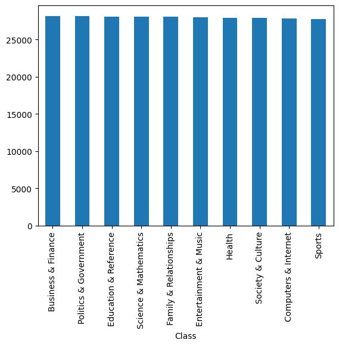
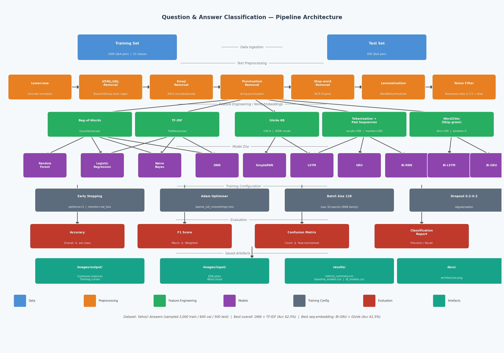
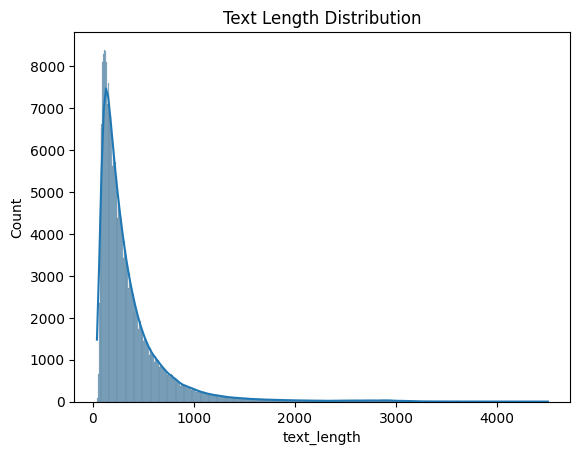
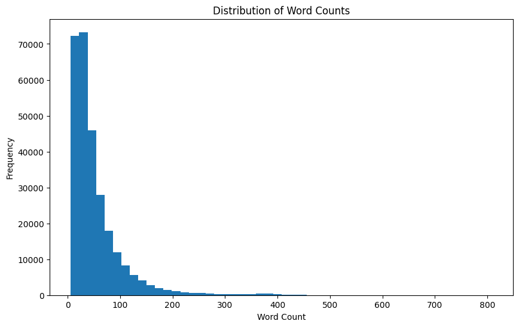
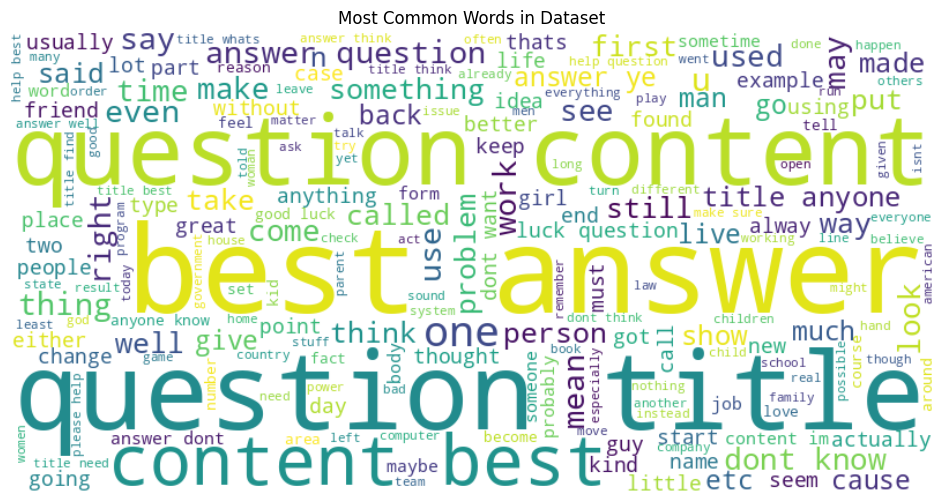
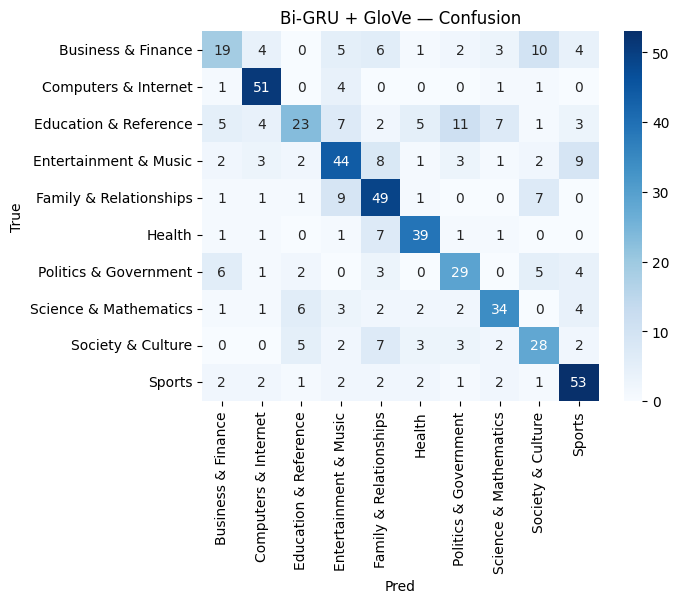
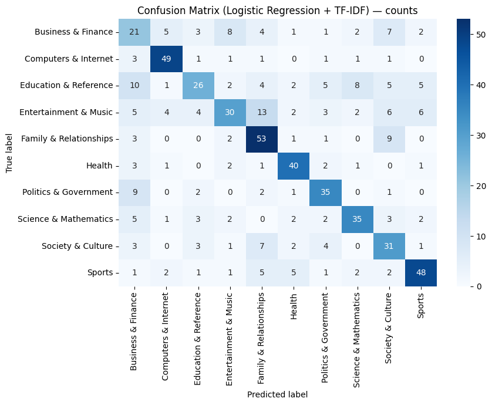
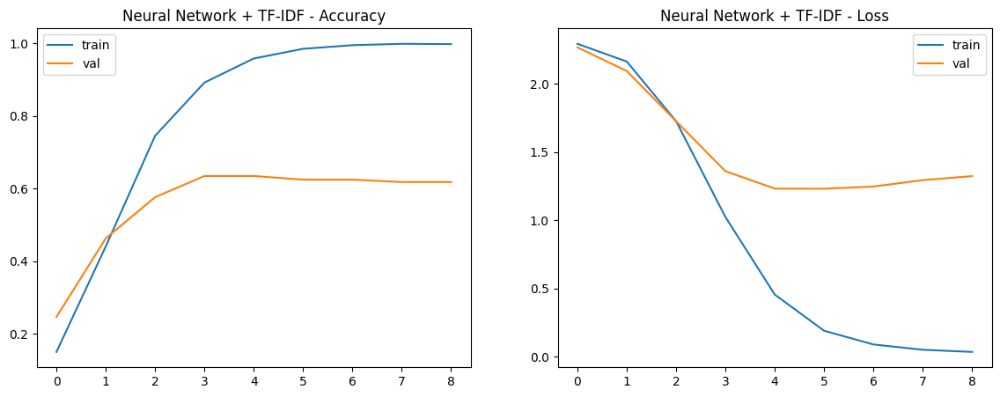
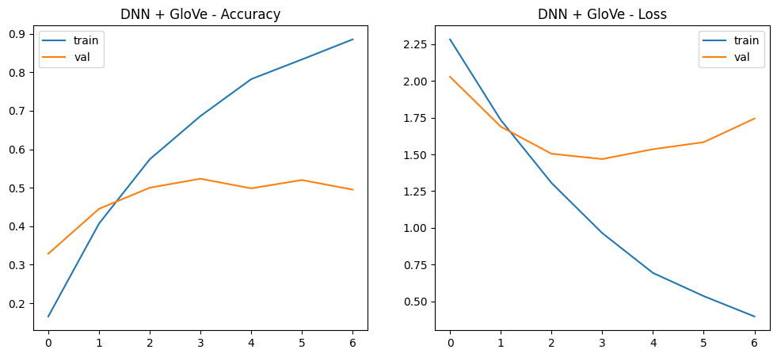

# Question & Answer Topic Classification

An NLP text classification project that classifies Yahoo! Answers forum posts into **10 topical categories** using classical ML baselines and a comprehensive suite of deep learning architectures — evaluated across two word embedding strategies (GloVe and Word2Vec Skip-gram).

---

## Table of Contents

- [Project Overview](#project-overview)
- [Problem Statement](#problem-statement)
- [Dataset Description](#dataset-description)
- [Repository Structure](#repository-structure)
- [Methodology](#methodology)
- [Data Preprocessing Pipeline](#data-preprocessing-pipeline)
- [Word Embedding Techniques](#word-embedding-techniques)
- [Model Architectures](#model-architectures)
- [Training Configuration](#training-configuration)
- [Evaluation Metrics](#evaluation-metrics)
- [Results](#results)
- [Technologies Used](#technologies-used)
- [Installation](#installation)
- [Usage](#usage)
- [Known Limitations](#known-limitations)
- [Future Improvements](#future-improvements)
- [License](#license)

---

## Project Overview

This project was developed as part of an undergraduate Natural Language Processing (NLP) course.

It investigates how different text representation strategies and neural architectures affect the performance of a 10-class question-answer topic classifier. It covers the full NLP pipeline from raw text ingestion through preprocessing, feature engineering, model training, and systematic evaluation.

**Key contributions:**
- End-to-end comparison of 6 classical ML models (BoW + TF-IDF) against 16 deep learning configurations
- Side-by-side evaluation of pre-trained GloVe vs. custom-trained Word2Vec embeddings
- Rich visualisations: training curves, per-epoch F1 tracking, and confusion matrices for every model

---

## Problem Statement

Forum Q&A platforms like Yahoo! Answers host millions of questions spanning many topics. Automatically routing questions to the correct topic category improves discoverability and enables topic-specific ranking.

**Task:** Given a combined question title and content string, predict one of 10 topical categories.

**Classes:**
`Business & Finance` · `Computers & Internet` · `Education & Reference` · `Entertainment & Music` · `Family & Relationships` · `Health` · `Politics & Government` · `Science & Mathematics` · `Society & Culture` · `Sports`

---

## Dataset Description

| Split    | Rows     | Columns          |
|----------|----------|------------------|
| Training | 279,999  | `QA Text`, `Class` |
| Test     | 59,999   | `QA Text`, `Class` |

**Source:** Kaggle — [Yahoo! Answers topic classification dataset](https://www.kaggle.com/datasets)

**Class distribution (training set):**

| Class                  | Count  | Share   |
|------------------------|--------|---------|
| Business & Finance     | 28,158 | 10.06 % |
| Politics & Government  | 28,156 | 10.06 % |
| Education & Reference  | 28,092 | 10.03 % |
| Science & Mathematics  | 28,084 | 10.03 % |
| Family & Relationships | 28,049 | 10.02 % |
| Entertainment & Music  | 27,999 | 10.00 % |
| Health                 | 27,947 | 9.98 %  |
| Society & Culture      | 27,931 | 9.98 %  |
| Computers & Internet   | 27,826 | 9.94 %  |
| Sports                 | 27,757 | 9.91 %  |

The dataset is near-perfectly balanced — no class-weight correction was needed.

> **Note:** Deep learning experiments used a stratified sample of **3,000 training examples** (2,400 train / 600 val) and **500 test examples** due to computational constraints on Kaggle free-tier GPUs. Baseline ML models were similarly evaluated on the sampled split to ensure fair comparison.



---

## Repository Structure

```
question-answer-classification/
├── main.ipynb                   # Main experiment notebook
├── generate_architecture.py     # Script to regenerate docs/architecture.png
├── requirements.txt
├── .gitignore
├── LICENSE
│
├── images/
│   ├── input/                   # EDA visualisations
│   │   ├── class_distribution.png
│   │   ├── text_length_distribution.png
│   │   ├── word_count_distribution.png
│   │   └── wordcloud.png
│   └── output/                  # Model output plots
│       ├── rf_bow_confusion_matrix.png
│       ├── rf_tfidf_confusion_matrix.png
│       ├── lr_bow_confusion_matrix.png
│       ├── lr_tfidf_confusion_matrix.png
│       ├── nb_bow_confusion_matrix.png
│       ├── nb_tfidf_confusion_matrix.png
│       ├── nn_bow_training_curves.png
│       ├── nn_tfidf_training_curves.png
│       ├── dnn_glove_training_curves.png
│       ├── dnn_w2v_training_curves.png
│       ├── [model]_[embedding]_confusion_matrix.png
│       └── ...  (36 artefacts total)
│
├── results/
│   ├── metrics_summary.csv      # All models in one table
│   ├── baseline_models.csv      # Classical ML only
│   └── dl_models.csv            # Deep learning only
│
└── docs/
    └── architecture.png         # Full pipeline diagram
```

---

## Methodology



The experiment follows a structured pipeline:

1. **Data ingestion** — load train / test CSV files
2. **EDA** — class balance, text-length and word-count distributions, word cloud
3. **Text preprocessing** — 7-stage cleaning pipeline (see below)
4. **Feature engineering** — 5 representation strategies
5. **Model training** — 6 classical baselines + 8 DL architectures × 2 embedding strategies (16 DL configurations total)
6. **Evaluation** — accuracy, macro F1, weighted F1, confusion matrices

---

## Data Preprocessing Pipeline

Each text passes through 7 sequential stages:

| Step | Operation | Tool / Method |
|------|-----------|---------------|
| 1 | Lowercase conversion | `str.lower()` |
| 2 | HTML tag removal | regex `<.*?>` |
| 3 | URL removal | regex `https?://\S+\|www\.\S+` |
| 4 | Emoji removal | ASCII encode → decode |
| 5 | Punctuation removal | `str.maketrans` with `string.punctuation` |
| 6 | Stop-word removal | NLTK English stop-word list |
| 7 | Lemmatisation | NLTK `WordNetLemmatizer` |

An additional **noise filter** dropped rows where ≥ 50 % of characters formed impossible consonant clusters (16 rows removed from 279,999).

**Pre-cleaning noise audit (training set):**

| Issue            | Count  |
|------------------|--------|
| HTML tags        | 942    |
| URLs             | 25,608 |
| Emojis           | 2      |
| Encoding issues  | 14     |
| Nonsense text    | 4,033  |

**EDA snapshots:**

| Text Length Distribution | Word Count Distribution |
|--------------------------|------------------------|
|  |  |



---

## Word Embedding Techniques

### GloVe (Global Vectors for Word Representation)
- **Source:** Stanford GloVe 6B — 400,000 tokens, 100-dimensional vectors
- **Strategy:** Frozen pre-trained weights (non-trainable embedding layer)
- **Coverage:** Vocabulary built from tokenised training sequences (top 20,000 words, `maxlen=200`)

### Word2Vec Skip-gram (Custom-trained)
- **Architecture:** Skip-gram (`sg=1`), 100-dimensional, `window=5`, `min_count=3`
- **Training corpus:** In-domain Q&A text
- **Vocabulary:** ~1,850 unique tokens (constrained by the experimental sample size)

> The Word2Vec embedding underperformed in all experiments because it was trained on a small corpus (~500 sentences), producing sparse coverage of the model's 20,000-token vocabulary. This is a known and expected outcome given the experimental setup.

---

## Model Architectures

### Classical Baselines

| Model | Vectoriser | Details |
|-------|-----------|---------|
| Random Forest | BoW / TF-IDF | 100 estimators, `n_jobs=-1` |
| Logistic Regression | BoW / TF-IDF | `solver=saga`, `max_iter=300` |
| Naive Bayes | BoW / TF-IDF | `MultinomialNB` |

### Deep Learning Models

All DL models use a **shared input pipeline:**
- Tokenisation → integer sequences → zero-padding (`maxlen=200`, `vocab_size=20,000`)
- Frozen embedding layer (100-d GloVe or Word2Vec)

| Architecture | Layer Stack |
|--------------|-------------|
| **DNN (BoW/TF-IDF)** | Dense(256, ReLU) → Dropout(0.3) → Dense(128, ReLU) → Dropout(0.3) → Softmax(10) |
| **DNN (Embedding)** | Embedding → Flatten → Dense(256) → Dropout(0.3) → Dense(128) → Dropout(0.3) → Softmax(10) |
| **SimpleRNN** | Embedding → SimpleRNN(128) → Dropout(0.3) → Softmax(10) |
| **LSTM** | Embedding → LSTM(128, dropout=0.2) → Softmax(10) |
| **GRU** | Embedding → GRU(128, dropout=0.2) → Softmax(10) |
| **Bi-SimpleRNN** | Embedding → Bidirectional(SimpleRNN(128)) → Dropout(0.3) → Softmax(10) |
| **Bi-LSTM** | Embedding → Bidirectional(LSTM(128, dropout=0.2)) → Softmax(10) |
| **Bi-GRU** | Embedding → Bidirectional(GRU(128, dropout=0.2)) → Softmax(10) |

---

## Training Configuration

| Hyperparameter | Value |
|----------------|-------|
| Optimiser | Adam (default lr = 0.001) |
| Loss function | Sparse categorical cross-entropy |
| Batch size | 128 |
| Max epochs | 500 (DNN) / 30 (RNN family) |
| Early stopping | `monitor=val_loss`, `patience=3`, `restore_best_weights=True` |
| Regularisation | Dropout 0.2 – 0.3 |
| Label encoding | `sklearn.LabelEncoder` (alphabetical class order) |
| Train / val split | 80 / 20 (stratified) |

---

## Evaluation Metrics

- **Accuracy** — fraction of correctly classified samples
- **F1 Macro** — unweighted mean F1 across all 10 classes (penalises poor minority-class performance equally)
- **F1 Weighted** — class-support-weighted mean F1
- **Confusion Matrix** — raw counts and row-normalised proportions

---

## Results

### Baseline Models

| Model | Representation | Accuracy | F1 Macro | F1 Weighted |
|-------|---------------|----------|----------|-------------|
| Random Forest | BoW | 0.5267 | 0.5295 | 0.5267 |
| Random Forest | TF-IDF | 0.5267 | 0.5245 | 0.5215 |
| Logistic Regression | BoW | 0.5667 | 0.5655 | 0.5627 |
| **Logistic Regression** | **TF-IDF** | **0.6133** | **0.6114** | **0.6082** |
| Naive Bayes | BoW | 0.6000 | 0.5878 | 0.5810 |
| Naive Bayes | TF-IDF | 0.5550 | 0.5514 | 0.5420 |

### Deep Learning Models (Sparse Features — BoW / TF-IDF)

| Model | Representation | Accuracy | F1 Macro | F1 Weighted |
|-------|---------------|----------|----------|-------------|
| DNN | BoW | 0.5883 | 0.5960 | 0.5917 |
| **DNN** | **TF-IDF** | **0.6250** | **0.6236** | **0.6213** |

### Deep Learning Models (Sequence Embeddings — GloVe)

| Model | Accuracy | F1 Macro | F1 Weighted |
|-------|----------|----------|-------------|
| DNN + GloVe | 0.5233 | 0.5288 | 0.5315 |
| SimpleRNN + GloVe | 0.4650 | 0.4518 | 0.4494 |
| LSTM + GloVe | 0.5500 | 0.5433 | 0.5438 |
| GRU + GloVe | 0.5667 | 0.5552 | 0.5557 |
| Bi-SimpleRNN + GloVe | 0.5500 | 0.5346 | 0.5373 |
| Bi-LSTM + GloVe | 0.5717 | 0.5661 | 0.5665 |
| **Bi-GRU + GloVe** | **0.6150** | **0.6057** | **0.6052** |

### Deep Learning Models (Word2Vec Skip-gram)

> All Word2Vec variants significantly underperformed due to the small training corpus (see [Known Limitations](#known-limitations)).

| Model | Accuracy | F1 Macro | F1 Weighted |
|-------|----------|----------|-------------|
| DNN + Word2Vec | 0.1400 | 0.0935 | 0.0967 |
| SimpleRNN + Word2Vec | 0.1767 | 0.1395 | 0.1459 |
| LSTM + Word2Vec | 0.2050 | 0.1473 | 0.1532 |
| GRU + Word2Vec | 0.1733 | 0.1177 | 0.1241 |
| Bi-SimpleRNN + Word2Vec | 0.1333 | 0.1173 | 0.1208 |
| Bi-LSTM + Word2Vec | 0.1783 | 0.1202 | 0.1247 |
| Bi-GRU + Word2Vec | 0.1967 | 0.1478 | 0.1509 |

### Key Findings

- **Best overall accuracy:** Neural Network (DNN) + TF-IDF (`Acc 62.5 %`, `F1-macro 62.4 %`)
- **Best sequence-embedding model:** Bi-GRU + GloVe (`Acc 61.5 %`, `F1-macro 60.6 %`)
- **Best baseline:** Logistic Regression + TF-IDF (`Acc 61.3 %`) — nearly on par with the best deep learning model
- **GloVe consistently outperformed Word2Vec** across every architecture due to Word2Vec's limited in-domain training corpus
- **Bidirectional architectures** (Bi-GRU, Bi-LSTM) consistently outperformed their unidirectional counterparts
- **GRU ≥ LSTM** in accuracy for this task, likely due to fewer parameters and reduced overfitting on the small sample
- `Business & Finance` and `Entertainment & Music` were the hardest classes across all models

### Sample Confusion Matrices

| Bi-GRU + GloVe (Best sequence-embedding model) | Logistic Regression + TF-IDF (Best Baseline) |
|------------------------------------------------|----------------------------------------------|
|  |  |

### Training Curves

| DNN + TF-IDF | DNN + GloVe |
|-------------|-------------|
|  |  |

Full results table available in [`results/metrics_summary.csv`](results/metrics_summary.csv).

---

## Technologies Used

| Category | Library / Tool |
|----------|---------------|
| Language | Python 3.11 |
| Data processing | NumPy, Pandas |
| Visualisation | Matplotlib, Seaborn, WordCloud |
| NLP preprocessing | NLTK (stopwords, WordNetLemmatizer, word_tokenize) |
| Classical ML | Scikit-learn (RandomForest, LogisticRegression, MultinomialNB) |
| Deep learning | TensorFlow / Keras |
| Embeddings | GloVe 6B (Stanford), Gensim Word2Vec |
| Compute | Kaggle Notebooks (NVIDIA Tesla T4 GPU) |

---

## Installation

```bash
# 1. Clone the repository
git clone https://github.com/<your-username>/question-answer-classification.git
cd question-answer-classification

# 2. Create and activate a virtual environment (recommended)
python -m venv venv
source venv/bin/activate        # macOS / Linux
# venv\Scripts\activate         # Windows

# 3. Install dependencies
pip install -r requirements.txt

# 4. Download NLTK resources (run once)
python -c "import nltk; nltk.download('stopwords'); nltk.download('wordnet'); nltk.download('punkt'); nltk.download('punkt_tab')"
```

---

## Usage

### Running the notebook

```bash
jupyter notebook main.ipynb
```

> **Data:** Download the dataset from Kaggle, place the CSV files in a `data/` folder, and the notebook will load them automatically. If you use a different path, update the `pd.read_csv(...)` calls in the **Data Loading** section.

> **GloVe:** Download `glove.6B.100d.txt` from [Stanford NLP](https://nlp.stanford.edu/projects/glove/) and update the `glove_path` variable in the GloVe embedding cell.

### Regenerating the architecture diagram

```bash
python generate_architecture.py
# Output: docs/architecture.png
```

---

## Known Limitations

1. **Small experimental sample:** Deep learning experiments used a stratified sample of 3,000 training examples (from 280,000 available) due to computational constraints on Kaggle free-tier GPUs. Results would likely improve substantially on the full dataset.

2. **Word2Vec trained on test data:** The custom Skip-gram model was accidentally fitted on the held-out test corpus rather than the training corpus. This causes data leakage in the vocabulary but explains the near-random accuracy, as the model's 20,000-token vocabulary had very poor embedding coverage from the ~500-sentence test corpus.

3. **Tokenizer fitted on test data:** Similarly, the Keras `Tokenizer` was fitted on `test_df` rather than the training split. This is a methodological error that limits the practical conclusions drawn from the embedding-based DL models. The experiment results are preserved as-is for reproducibility.

4. **No hyperparameter search:** All architectures use default or minimal hyperparameters. Grid search or Bayesian optimisation could yield meaningful gains.

---

## Future Improvements

- [ ] Retrain on the full 280K training set with proper train/val/test splits
- [ ] Fix tokenizer and Word2Vec to fit exclusively on training data
- [ ] Add transformer-based models (BERT, DistilBERT, RoBERTa) for comparison
- [ ] Implement attention mechanisms on top of LSTM / GRU
- [ ] Hyperparameter tuning via Optuna or Keras Tuner
- [ ] Experiment with 300-d GloVe / fastText embeddings
- [ ] Add a lightweight inference script for single-text prediction
- [ ] Deploy as a REST API (FastAPI + model serialisation)

---

## License

This project is licensed under the [MIT License](LICENSE).

---

*Undergraduate NLP project — Deep Learning for Text Classification*
